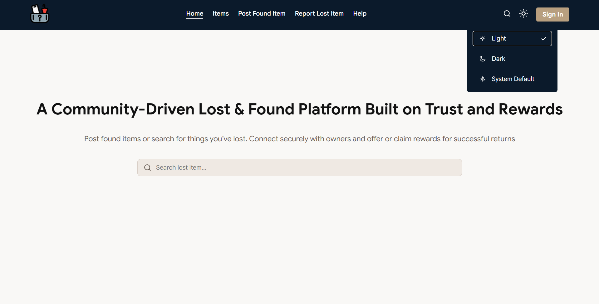
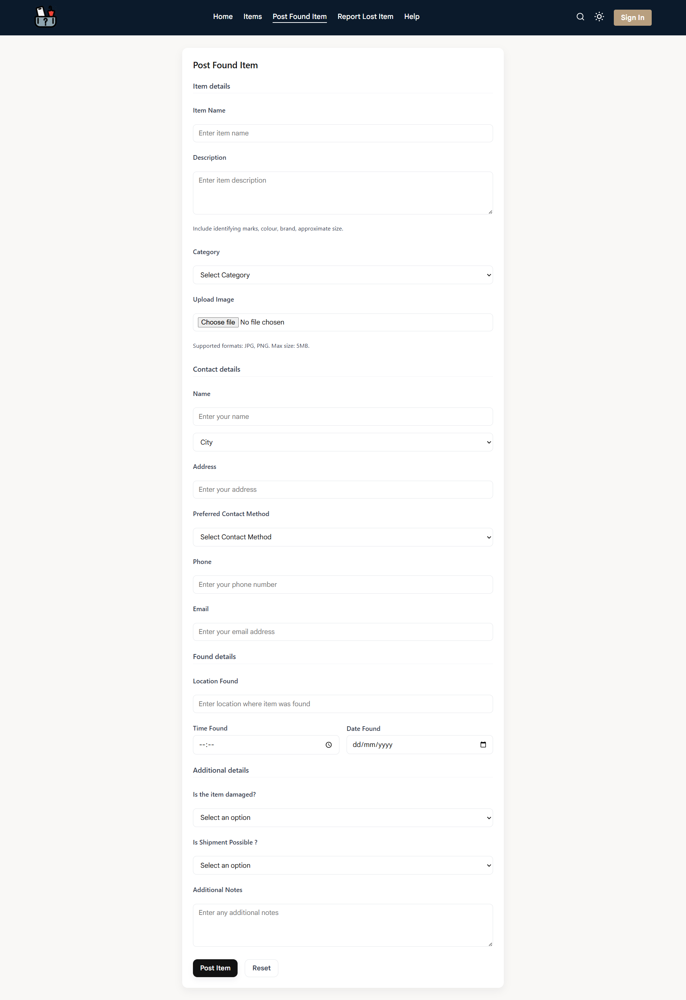
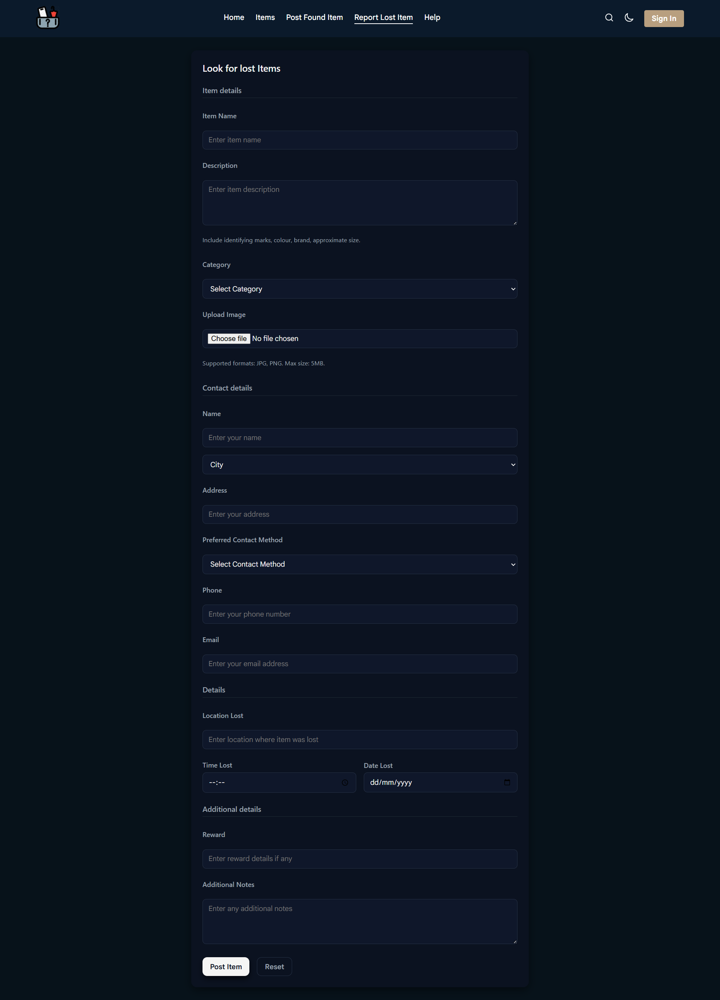
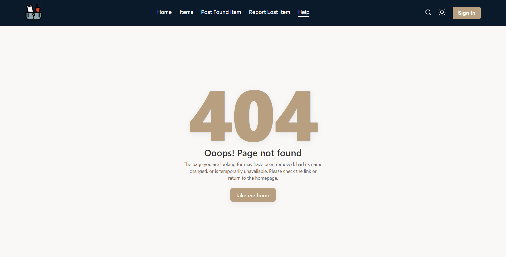

# Lost & Found

## Project overview

A full‑stack application letting users post **found** items (optionally offering a reward) and **lost** reports. Finders can upload photos and location details; owners can search, match, and request contact or file claims. The codebase is split into `backend/` (Express + TypeScript + Mongoose) and `frontend/` (React + TypeScript).

---

## Key features

* Secure authentication using JWTs in HTTP-only cookies with server-side sessions, automatic login, token refresh, and CSRF protection.
* Post found items, or report a lost item (image, description, location, optional reward ...)
* Browse found/lost items
* Light / Dark / System theme with persistent user preference


---

## Tech stack

* **Frontend:** React + TypeScript, Vite , CSS Modules
* **Backend:** Node.js, Express, TypeScript, Mongoose
* **Database:** MongoDB
* **Storage:**  multer , local `uploads/`
---

## Architecture & folder layout

Project structure :

```
/backend
├─ src
│ ├─ config        # Database connection logic
│ ├─ controllers   # Request handling 
│ ├─ middlewares   # Validation, rate limiting, image upload ...
│ ├─ models        # Database schemas  
│ ├─ routes        # API route definitions
│ ├─ schemas       # Zod schemas for validation
│ ├─ services      # LOGIC (DB interactions)
│ ├─ utils         # Helper functions
│ └─ server.ts     # Main
├─ uploads         # This repository includes compressed items photos
├─ .env            # Secrets
├─ .gitignore
└─ vite.config.ts

/frontend
├── public
├── src
│   ├── assets         # Static asstets (images , logos, placehoders)
│   ├── components     # Reusable UI building blocks (Buttons, Inputs, Modals)
│   ├── hooks          # Custom React hooks for shared logic
│   ├── pages          # Top-level route components (Home, Items, Signin)
│   ├── utils          # Helper functions
│   ├── styles.d.ts    # TypeScript definitions for CSS modules
│   ├── App.tsx        # Main application component and routing configuration
│   ├── main.tsx       # Application entry point
│   ├── index.css      # Global styles, CSS resets
│   └── App.css        # Root variables 
├── .env               # Environment variables
└── vite.config.ts

/ScreenShots       #This repository includes screenshots that demonstrate  the Lost & Found web app
```


---

## Getting started (development)

**Prerequisites:** Node, npm, .env variables

**Install & run**

```bash
# server
cd backend
npm install
npm run dev

# client
cd frontend
npm install
npm run dev
```

Open the client (`http://localhost:5173`) and the server (`http://localhost:5000`).

---

## Environment variables

Example `backend/.env`:

```
# Environment
NODE_ENV=development

# Server
PORT=5000
CLIENT_URL=http://localhost:5173

# Database 
MONGO_URI=mongodb://127.0.0.1:27017/lostandfound

# Security & auth
# bcrypt salt rounds (integer). Recommended: 12 (acceptable range: 8-16)
BCRYPT_SALT_ROUNDS=12

# JWT & session durations
JWT_SECRET=replace_with_a_long_random_secret_string
JWT_ACCESS_EXPIRES=15m               # format: e.g. 15m = 15 minutes
JWT_REFRESH_EXPIRES_REMEMBER=7d     # format: e.g. 7d = 7 days
JWT_REFRESH_EXPIRES_DEFAULT=1d      # format: e.g. 1d = 1 day

# Application limits
MAX_SESSIONS=5                      # integer: maximum concurrent sessions per user


```

Example `frontend/.env` (Vite):

```
VITE_API_BASE_URL=http://localhost:5000
```

---

## Database models (Mongoose) — example

**Item (simplified)**

```ts
{
  title: String,
  description: String,
  category: String,
  dateOccurred: Date,
  location: String,
  status: { type: String, enum: ['found', 'lost', 'returned'] },
  reward: Number,
  holder: {
    street: String,
    state: String,
    postal: String
  },
  contact: {
    name: String,
    email: String,
    phone: String,
    preferContact: { type: String, enum: ['email', 'phone', 'text'], default: 'phone' }
  },
  image: {
    filename: String,
    mimetype: String,
    size: Number,
    path: String,
    uploadedAt: Date
  },
  additionalNotes: String
}, { timestamps: true }
```

---

## API endpoints

Base path: `/api`

* `GET /health`    — verify api running

**Items endpoints**

* `POST /postitem` — post found item
* `POST /lookitem` — look for lost items
* `GET /items`     — get all items

**User endpoints**  
* `POST /auth/singin`         — create user
* `POST /auth/signup`         — Login user session
* `POST /auth/logout`         — logout user from session
* `POST /auth/refresh-token`  — refresh user tokens
* `GET  /me`             — get user data (require active user session)
* `GET /user/:id`        — get user data by id
* `GET  /users`           — get all users data
  
---

## Client routing (createBrowserRouter) — example

```tsx
const router = createBrowserRouter([
  {
    path: "/",
    element: <MainLayout />,
    errorElement: <NotFound />,
    children: [
      {
        index: true,
        element: <Home />
      },
      {
        path: "lookforitem",
        element: <LookItem />
      },
      {
        path: "postfounditem",
        element: <PostItem />
      },{
        path: "items",
        element: <Items />
      }
    ]
  }
]);
```

## Authentication overview (JWT + HTTP cookies)

This app uses a cookie-based JWT authentication system combined with server-side session records and CSRF protection.  
The implementation created for this project follows these principles:

- Short-lived **access token** (JWT) kept in an `HttpOnly` cookie for accessing protected routes.  
- Long-lived **refresh token** (JWT) kept in an `HttpOnly` cookie used only at the refresh endpoint to obtain new access tokens.  
- A server-side **session record** (referenced by an `HttpOnly` `SESSION_ID` cookie) that enables revocation, session listing, and session limits.  
- A non-`HttpOnly` **CSRF token cookie** that the frontend reads and forwards in an authentication header; the backend middleware verifies that the header value matches the session-stored CSRF token.

> Registration performs an automatic sign-in: `signup` creates the user, opens a session, issues tokens, and sets all required cookies.

---

### Cookie names (as used in this project)
- `session_id` — **HttpOnly** opaque session identifier. Server uses it to lookup and manage session state.  
- `acess_token` — **HttpOnly** JWT with a short TTL. Used by server middleware to authenticate protected requests.  
- `refresh_token` — **HttpOnly** JWT with a long TTL. Sent automatically by the browser to the refresh endpoint; used to obtain a new `acess_token`.  
- `csrf_token` — **NOT HttpOnly**. Random token stored in the session and set as a cookie so client-side JavaScript can read it and send it in an authentication header.

---

### Cookie attributes (recommended / used)
- `HttpOnly`: `true` for `SESSION_ID`, `ACCESS_TOKEN`, `REFRESH_TOKEN`. `false` for `CSRF_TOKEN`.  
- `Secure`: `true` in production (HTTPS).  
- `SameSite`: `Lax` .  
- `Path`:  `/`.  
- `Max-Age` / TTLs: defined by environment configuration (access token short, refresh token long).

---

## Flows (endpoints & behavior)

### `POST /auth/signup`
1. Validate input and create the user.  
2. Create a server-side session record:
   - generate `sessionId` and `csrfToken`, store both in the session record.  
3. Sign `ACCESS_TOKEN` and `REFRESH_TOKEN` JWTs containing at least `{ userId, sessionId }`.  
4. Set four cookies: `SESSION_ID` (HttpOnly), `ACCESS_TOKEN` (HttpOnly), `REFRESH_TOKEN` (HttpOnly), `CSRF_TOKEN` (readable by JS).  
5. Respond with user info (no tokens in the response body). Result: user is automatically logged in after registration.

### `POST /auth/signin`
1. Validate credentials.  
2. Enforce session limits if configured (e.g., `MAX_SESSIONS`).  
3. Create session, sign tokens, set the same four cookies as in registration.  
4. Respond with user info.

### Protected routes (middleware)
1. Middleware reads `ACCESS_TOKEN` from cookie and verifies signature & expiry.  
2. Extract `sessionId` from token payload and fetch the server-side session:
   - If session is missing or revoked → `401`.  
3. For state-changing HTTP methods (POST, PUT, PATCH, DELETE), require CSRF verification:
   - Read header (e.g. `X-CSRF-Token`) sent by the client.  
   - Compare header value with the `csrfToken` stored in the session. If mismatched → `403`.  
4. On success attach `req.user` (or equivalent) and continue.
   
> IF `ACCESS_TOKEN` is expired, and the user have a valid `REFRESH_TOKEN`, its used to generate a new acess token.

### `POST /auth/refresh-token`
1. Browser automatically sends `REFRESH_TOKEN` and `SESSION_ID` cookies.  
2. Server verifies `REFRESH_TOKEN` and session validity.  
3. If valid, issue a fresh `ACCESS_TOKEN` (and optionally rotate `REFRESH_TOKEN`) and set the cookie(s).  
4. If invalid or expired → `401` (client must re-authenticate).

### `POST /auth/signout`
1. Revoke the session server-side (mark revoked or delete).  
2. Clear `SESSION_ID`, `ACCESS_TOKEN`, `REFRESH_TOKEN`, and `CSRF_TOKEN` cookies.  
3. Respond `200`.

---

## CSRF protection (double-submit / server verification)
- A cryptographically secure `csrfToken` is generated when a session is created and stored in the session record.  
- The server sets a `CSRF_TOKEN` cookie (non-HttpOnly) containing the same token so frontend JS can read it.  
- The frontend reads `CSRF_TOKEN` and sends it on state-changing requests in a header (for example `X-CSRF-Token`). Example:

```ts
await axios.put('/api/user/user_id', payload, {   withCredentials: true, headers: { 'x-csrf-token': token } });
```


## Image Processing Architecture

#### 1. Request Handling (Memory Buffer)
Images are initially held in a temporary memory buffer via Multer.

* **Validation First**: The server validates all form fields before any file is permanently written to disk.

* **Efficiency**: If form validation fails, the memory is cleared, preventing junk files.
  
#### Post-Validation Processing
Once the request is validated, the image undergoes a transformation using Sharp :

* **Compression & Format**: Images are converted to .webp format with a quality setting of 80%.
  
* **Resizing**: Images are automatically scaled to a maximum width of 800px .

#### 3. Dynamic Storage Strategy
Files are organized into a hierarchical directory structure :

* **Structure**: /uploads/YYYY/MM/DD/unique-uuid.webp
  
* **Path Logic**: The system automatically generates nested subfolders based on the current date and assigns a unique UUID to every file to prevent filename collisions.


---
## Dark/Light/System theme implementation notes

* Store preference in `localStorage` as `'light'|'dark'|'system'`.
  
* If `system`, resolve active theme with `window.matchMedia('(prefers-color-scheme: dark)')`.
  
* Apply a `data-theme` attribute on `document.documentElement` ('light' or 'dark') and manage colors with CSS variables. Provide a `useTheme` hook that exposes `choice` and `setChoice`.

---

## Images / Visual Assets

### Home Page
| Light mode | Dark mode |
|---:|---|
<a href="ScreenShots/HomePageLightMode.png">
  
</a> | 
<a href="ScreenShots/HomePageDarkMode.png">
  
</a> |

### Post/look for Items Form
| Post found Items | Post lost Items |
|---:|---|
<a href="ScreenShots/postFoundItem.png">
  
</a> | 
<a href="ScreenShots/postLostItem.png">
  
</a> |

### Error Page
<a href="ScreenShots/ErrorPage.png">
  
</a>


---


## License & contact

This project is released under the **MIT License**.

Maintainer: Ahmed Klai — [ahmedklai.connect@gmail.com](mailto:ahmedklai.connect@gmail.com)
